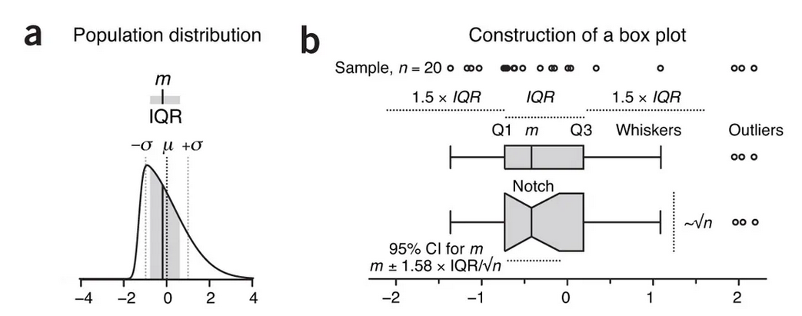

.center[
# Riassunto della scorsa puntata
]

1. Statistics do not tell us whether we are right. It tells us the **chances of being wrong**.

1. The best we can do is estimate them using **collected data through the process of sampling**.

1. **Larger samples** approximate the population better.

1. Samples are our **windows to the population**, and their statistics are used to estimate those of the population.

1.  Always keep in mind that your **measurements are estimates**, which you should not endow with an aura of exactitude and finality. 

1. The **omnipresence of variability** will ensure that each sample will be different.

--

.content-box-grey[.tiny[
- The **mean** is calculated as the arithmetic average of values and can be unduly influenced by extreme values
  
- The **standard deviation** is calculated based on the square of the distance of each value from the mean

- The **median** is a more robust measure of location and more suitable for distributions that are skewed or otherwise irregularly shaped
]]


---

.center[
## Anscomb quartet
]

--

```{r echo = FALSE}
library(DT)
library(broom)
library(tidyverse)

mydata=with(anscombe,data.frame(xVal=c(x1,x2,x3,x4), yVal=c(y1,y2,y3,y4), mygroup=gl(4,nrow(anscombe))))

a <- mydata %>% 
  group_by(mygroup) %>% 
  nest() %>% 
  mutate(MEDIA = map(data, ~mean(.$yVal)),
         SD = map(data, ~sd(.$yVal)),
         VAR = map(data, ~var(.$yVal)),
         COR = map(data, ~cor(.$xVal, .$yVal)),
         CC = map(data, ~tidy(lm(.$yVal ~ .$xVal)) %>% select(CC = estimate) %>% slice(1))) %>% 
  unnest(MEDIA:CC) %>%
  mutate_at(vars("MEDIA":"CC"), ~round(., 2))

knitr::kable(a$data[[1]], format = 'html')
```


---

.center[
## Anscomb quartet
]


.middle[
```{r echo = FALSE}
knitr::kable(a %>% select(-data), format = 'html')
```
]

---

.center[
## Anscomb quartet

```{r echo = FALSE}
ggplot(mydata,aes(x=xVal,y=yVal,group=mygroup)) +
  geom_point() +
  geom_smooth(method = "lm", se = FALSE) +
  facet_wrap(~mygroup)
```

]

---
class: inverse, center, middle


# Part I


### Use boxplot to illustrate the spread and differences of samples

---

## Box plots

1. Visualization methods enhance our understanding of sample data and help us make comparisons across samples

--

1. Box plot is a method for graphically depicting groups of numerical data through their quartiles

--

  - A quartile is a type of quantile which divides the number of data points into four more or less equal parts, or quarters. 
    
--

  - The first quartile (Q1) is defined as the middle number between the smallest number and the median of the data set

--

  - The interquartile range (IQR = Q3 − Q1), which covers the central 50% of the data
  
--

  - Quartiles are insensitive to outliers and preserve information about the center and spread
  
---

## Box plots
.center[
.middle[




]
]

???

- The core element that gives the box plot its name is a box whose length is the IQR and whose width is arbitrary

- A line inside the box shows the median, which is not necessarily central

- The plot may be oriented vertically or horizontally

- Whiskers are conventionally extended to the most extreme data point that is no more than 1.5 × IQR from the edge of the box (Tukey style) or all the way to minimum and maximum of the data values (Spear style)

- The 1.5 multiplier corresponds to approximately ±2.7σ (where σ is s.d.) and 99.3% coverage of the data for a normal distribution

- Outliers beyond the whiskers may be individually plotted.

- Box plot construction requires a sample of at least n = 5 (preferably larger)
---

## Final considerations

1. For small sample sizes boxplots do not necessarily represent the distribution well

.center[

]

1. Strongly discourage using bar plots with error bars 

  - These charts continue to be prevalent (we counted 100 figures that used them in 2013 Nature Methods papers, compared to only 20 that used box plots)
  
  - The choice of baseline can interfere with assessing relative sizes of means and their error bars
 
  
##### Useful link: http://shiny.chemgrid.org/boxplotr/

---

class: inverse, center, middle


# Part II


### How uncertainty is represented

---

## Error bars

1. The **uncertainty** in estimates is customarily represented using error bars

--

1. A lot of **misconceptions** persist about how error bars relate to statistical significance

--

1. When asked to estimate the required separation between two points with error bars for a difference at significance P = 0.05, **only 22% of respondents were correct**

--

<br>
<br>

.center[
.content-box-red[
.Large[WHAT ABOUT YOU?]
]
<br>
.Large[http://bit.ly/2ufXHSR]
]


---

## Error bars

- **Standard deviation**: it shows how the data are spread

- **Standard error**: it describes how accurate the mean estimate is

- **Confident intervals**: it captures the true mean μ on 95% of occasions

.center[

]

---

## Error bars

<br>
<br>
.center[
```{r echo=FALSE}
# library(magick)
# 
# # Read image
# a <- image_read("aaa.png")
# 
# # Crop and save
# ##1
# a1 <- image_crop(a, "1047x150")
# image_write(a1, path = "a1.png", format = "png")
# ## 2
# a2 <- image_crop(a, "1047x200")
# image_write(a2, path = "a2.png", format = "png")
```


]

---

## Error bars

<br>
<br>
.center[


]

---

## Error bars

<br>
<br>
.center[


]

---


---

# Eigth rules
.small[
1. When showing error bars, always describe
in the **figure legends** what they are.

1. The value of n must be stated in
the **figure legend**.

1. Error bars and statistics
should only be shown for **independently repeated experiments**, and never for replicates

1. Experimental biologists
are usually trying to compare experimental results with controls, it is usually
**appropriate to show inferential error bars**, such as SE or CI, rather than SD

1. 95% CIs capture μ on 95%
of occasions, so you can be 95% confident your interval includes μ

1. when n = 3, and double the
SE bars don’t overlap, P < 0.05, and if
double the SE bars just touch, P is close to
0.05

1. with 95% CIs and n = 3,
overlap of one full arm indicates P ≈
0.05, and overlap of half an arm indicates
P ≈ 0.01

1. In the case of repeated measurements on the same group,
CIs or SE bars are irrelevant to comparisons within the same group
]
---

# Conclusion

1. Error bars can be valuable for understanding results and deciding whether the authors’ conclusions are
justifi ed by the data

--

1. When first seeing a figure with error bars, ask yourself:
  - “What is n?
  - Are they independent experiments, or just replicates?”
  - “What kind of error bars are they?”

--

<br>
.content-box-red[.center[Error bars and other statistics can only be a guide

You need to use your biological understanding to appreciate the meaning of the numbers shown in any figure
]
]


---

class: inverse, center, middle

.Huge[
END
]

